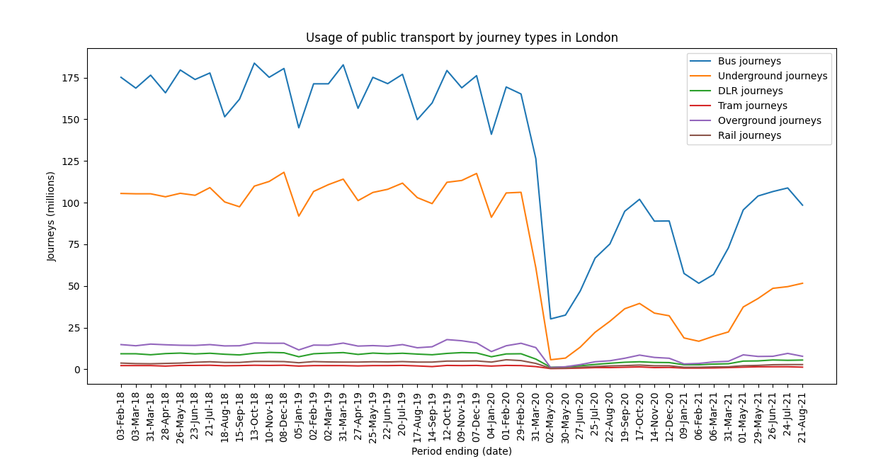

# Coursework 1

## Technical information

### Repository URL

[Repository](https://github.com/ucl-comp0035/coursework-1-azhar-nurgaliyeva)

### Set-up instructions

Assumption: requirements will be installed from requirements.txt.

**requirements.txt** has been generated using ***pipreqs*** based on all imports for the project.

## Data set

Transport - **"Public transport journeys by type of transport".** [1]

**Project idea**: explore how public transport use in London has changed due to the coronavirus pandemic.

## Selection of project methodology

### Methodology (or combination) selected

- Methodology - **Data Driven Scrum**

### Selection criteria and justification of selection

Criteria - experience of the team (i.e. me in this case) in particular methods. This is important because knowing
existing strengths is essential to approach weaknesses. It makes the process more efficient and effective.

The selected methodology is Data Driven Scrum, which is the combination of Scrum and Kanban board methods. Both methods
are agile frameworks, which is why they are particularly useful for data science projects. This methodology has been
chosen as I have an experience of working with it from my summer work experience. Moreover, this methodology gives
flexibility and transparency in all the processes. This is important as it is easier to trace back inefficiencies that
way.

Advantages of Data Driven Scrum:

- easier to accommodate tasks with uncertain time duration;
- efficient iterations;
- transparency of the processes within a team;
- no unnecessary meetings (time is not wasted).

Disadvantages of Data Driven Scrum:

- same template for backlog tasks required to avoid confusion;
- iteration review may happen randomly;
- it may cause confusion on the priority of certain tasks.

## Definition of the business need

### Problem definition

There are many types of public transportation in London. Trends in the usage of public transport change due to the
certain events such as road closures, construction works and so on. In 2020 and 2021, there were a lot of disruptions of
Transport for London (TfL) because of coronavirus pandemic. New regulations and changes led to the transition of
popularity for public transport journeys by type of transport. Due to an increased demand for transport, there is now a
problem of overcrowding, which is a safety risk.

### Target audience

The following is the description of the target audience for the product:

### Questions to be answered using the dataset

1) Is there any pattern in the changes of usage for public transportation in London?
2) Which group of public transportation consumers use the most?
3) Which category of people usually uses this type of transport the most?
4) Are trends similar to the performance before the pandemic?
5) Is it possible to reduce the overcrowding on certain types of transport?

Trends in the usage of transport types in London can help TfL analysts to come up with better project plans and
approaches.

All these questions are investigated in data exploration.

## Data preparation and exploration

### Data preparation

[Data Preparation](data_preparation.py)

The data set contains information about public transport journeys by type of transport in London. Both Excel and CSV
files of the data set are saved in the "data" folder. The prepared data set is saved as "prepared_dataset.csv".

Preparations:

1) Deleted all the rows with missing or null values.
2) Limited the data set from January 2018 to the latest available data (August 2021).
3) Reset the index to avoid confusion with columns.

### Prepared data set

[Original data set](data/tfl-journeys-type.csv) [1]

[Prepared data set](prepared_dataset.csv)

### Data exploration

[Data Exploration](data_exploration.py)

According to TfL, Emirates Airline did not run during first period. Moreover, it is not essential public transportation
type. Hence, it can be removed for the further data exploration part.

The numbers for Overground journey are only reliable from October 2010. The prepared data set is from the period of
January 2018 to the August 2021. Therefore, it is not a problem.

Period lengths (in days) are different in periods 1 and 13. This is why plots should be approached by using ending of
reporting periods. Plot of the graph of usage of different journey types in London:

**Question 1**: "Is there any pattern in the changes of usage for public transportation in London?"

**Answer 1**: "The usage of public transportation in London was more popular before the coronavirus pandemic in 2020.
There is a huge decrease in the utilisation of public transport during the period of March-May 2020. This was caused by
the national lockdown and extensive fear of coronavirus. A few months after that the indicators started to improve, but
in December-March 2021 there was another wave of coronavirus fear due to the emergence of Alpha COVID-19 variant. [2] It
was first identified in Kent, UK. [2] Since that period, the usage of public transportation is improving, but at a
relatively slower rate."

**Question 2**: "Which group of public transportation consumers use the most?"

**Answer 2**: "The most popular and the most used type of transport is bus. Underground is in the second place in terms
of popularity. Buses probably win as there are more routes and bus stops across London than tube stations. Moreover, the
price for bus journey is much cheaper than for underground journey. Overground, DRL, rail and tram journeys are
significantly less popular than bus and underground. Their usage remains about the same level as before the coronavirus
pandemic."

**Question 3**: "Which category of people usually uses this type of transport the most?"

**Answer 3**: "Buses and underground are mostly used by the people who are either working full-time or studying in
university. Therefore, the profile of a person who uses these 2 types of public transport the most are people in their
20-30s who need to commute every day."

Boxplot for the bus journeys in London from January 2018 to August 2021:

**Question 4**: "Are trends similar to the performance before the pandemic?"

**Answer 4**: "The amount of journeys is still smaller than before the pandemic, but in recent months the number of
journeys is steadily increasing. The minimum indicator of the data for bus journey is around 30 millions, whereas
maximum is approximately 185 millions. The average value is around 155 millions bus journeys. There are no significant
outliers in the data, if you do not consider national lockdown period as the outlier. All of these characteristics would
probably be higher if coronavirus pandemic did not happen. It will take some time for the transport sector to fully
recover the amount of public transport journeys."

**Question 5**: "Is it possible to reduce the overcrowding on certain types of transport?"

**Answer 5**: "There is a possibility of reducing the pressure on bus journey as they are still heavily overcrowded,
compared to all the other types of transport. In order to do that the strategy of reducing prices or introducing certain
discount on other journey types should be considered. Underground, overground, DLR and rail journeys usually cost more
than bus journey, which is why people might prefer that over anything else."

***Important notes***:

- DLR journeys are based on automatic passenger counts at the stations, whereas overground and tram journeys count
  passengers automatically on-carriage.
- The numbers for reporting period 1 are approximations which were deduced using retrospective adjustment.
- This data set did not include any alterations to the bus journeys numbers due to adjustments.

## Weekly progress reports

### Report 1

What I did in the last week:

- Got assigned a data set regarding the changes in journey types in London.
- Went through the list of methodologies and chose the most suitable one for my data set.
- Looked at the data set to understand the types of data there.

What I plan to do in the next week:

- Work on the problem statement
- Identify tha target audience

Issues blocking my progress (state 'None' if there are no issues):

- There are no issues at the moment.

### Report 2

What I did in the last week:

- Started editing comp0035_coursework1.md file with the selected methodology and reasoning.
- I identified the target audience for the problem statement.
- I have some ideas for the web app, but still thinking about which one should I go for.

What I plan to do in the next week:

- I plan to write up a problem statement and other business understanding related aspects in the document outline.
- Start on data preparation and recognise the importance of data ethics.

Issues blocking my progress (state ‘None’ if there are no issues):

- The only issue I have is that I can't commit and push changes through Git on PyCharm at the moment.

### Report 3

What I did in the last week:

- Resolved the issue with pushing changes to GitHub.
- Finalised the problem statement and target audience for the web app.
- Started prepping the data and trying to identify key questions to be answered.
- Analysed how the dataset could be reduced.

What I plan to do in the next week:

- Continue data exploration and making graphs to answer the key questions for the problem statement.

Issues blocking my progress (state ‘None’ if there are no issues):

- None

### Report 4

What I did in the last week:

- Continued on the data exploration
- Learnt how to identify and analyse requirements.

What I plan to do in the next week:

- Finish up with coursework 1 and submit it.

Issues blocking my progress (state ‘None’ if there are no issues):

- None (at the time of submitting report there were no issues, but when I was trying to save my graphs an issue of
  having blank graph appeared. However, it was not the case if I tried on a different device.)

## References

1. Public Transport Journeys by Type of Transport – London Datastore. [online] Available
   at: https://data.london.gov.uk/dataset/public-transport-journeys-type-transport.

2. Roberts, M. (2021). COVID-19: How worrying are the UK, South Africa, and Brazil coronavirus variants? BBC
   News. [online]
   5 Feb. Available at: https://www.bbc.co.uk/news/health-55659820.
