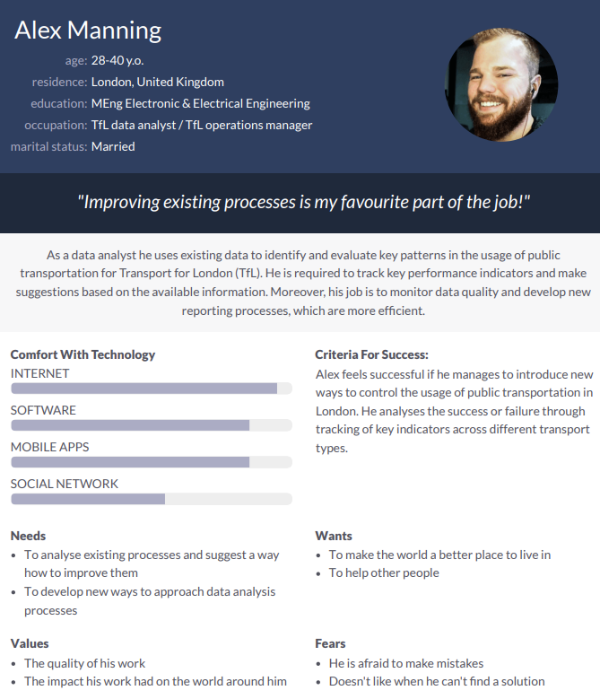

# Coursework 1

## Technical information
### Repository URL
Please add the URL to your repository below, then delete this instruction text.
[Repository](https://github.com/ucl-comp0035/coursework-1-azhar-nurgaliyeva)

### Set-up instructions

Assume that requirements will be installed from requirements.txt.

If you have used any libraries that require set-up beyond `pip install ...` then use this section to explain any set-up
instructions to be followed to run your coursework.

If the marker cannot execute your coursework they can't grade it!

## Data set
Transport - "Public transport journeys by type of transport".

Project idea: explore how public transport use in London has changed due to the coronavirus pandemic.

## Selection of project methodology
### Methodology (or combination) selected
- Methodology - Data Driven Scrum

### Selection criteria and justification of selection
Criteria - experience of the team (i.e. me in this case) in particular methods.
This criteria is important because knowing existing strengths is essential to approach weaknesses.
It makes the process more efficient and effective.

The selected methodology is Data Driven Scrum, which is the combination of Scrum and Kanban board methods.
Both methods are agile frameworks, which is why they are particularly useful for data science projects.
This methodology has been chosen as I have an experience of working with it from my summer work experience.
Moreover, this methodology gives flexibility and transparency in all the processes.
This is important as it is easier to trace back inefficiencies that way.

Advantages of Data Driven Scrum:
- easier to accommodate tasks with uncertain time duration;
- efficient iterations;
- transparency of the processes within a team;
- no unnecessary meetings (time is not wasted).

Disadvantages of Data Driven Scrum:
- same template for backlog tasks required to avoid confusion;
- iteration review may happen randomly;
- it may cause confusion on the priority of certain tasks.

## Definition of the business need
### Problem definition
There are many different types of public transportation in London.
Trends in the usage of public transport change due to the certain events such as road closures, construction works and so on.
In 2020 and 2021, there were a lot of disruptions of Transport for London (TfL) because of coronavirus pandemic.
New regulations and changes led to the transition of popularity for public transport journeys by type of transport.
Due to an increased demand for transport, there is now a problem of overcrowding, which is a safety risk.

### Target audience
The following is the description of the target audience for the product:

### Questions to be answered using the dataset
- Is there any pattern in the changes of usage for public transportation in London?
- Which group of public transportation consumers use the most?
- Which category of people usually uses transport at that time?
- Are trends similar to the performance before the pandemic?
- Is it possible to reduce the overcrowding on certain types of transport?

Trends in the usage of transport types in London can help TfL analysts to come up with better project plans and approaches.

## Data preparation and exploration
### Data preparation

[Data Preparation](data_preparation.py)

### Prepared data set
Please add names of your data set files in this repository below, then delete this instruction text.
[Original data set](data/tfl-journeys-type.csv)
[Prepared data set](prepared_dataset.csv)

### Data exploration

[Data Exploration](data_exploration.py)

## Weekly progress reports

### Report 1
What I did in the last week:
- Got assigned a data set regarding the changes in journey types in London. 
- Went through the list of methodologies and chose the most suitable one for my data set. 
- Looked at the data set to understand the types of data there.

What I plan to do in the next week:
- Work on the problem statement
- Identify tha target audience

Issues blocking my progress (state 'None' if there are no issues):
- There are no issues at the moment.

### Report 2
What I did in the last week:
- Started editing comp0035_coursework1.md file with the selected methodology and reasoning. 
- I identified the target audience for the problem statement. 
- I have some ideas for the web app, but still thinking about which one should I go for.

What I plan to do in the next week:
- I plan to write up a problem statement and other business understanding related aspects in the document outline. 
- Start on data preparation and recognise the importance of data ethics.

Issues blocking my progress (state ‘None’ if there are no issues):
- The only issue I have is that I can't commit and push changes through Git on PyCharm at the moment.

### Report 3
What I did in the last week:
- Resolved the issue with pushing changes to GitHub.
- Finalised the problem statement and target audience for the web app. 
- Started prepping the data and trying to identify key questions to be answered. 
- Analysed how the dataset could be reduced.

What I plan to do in the next week:
- Continue data exploration and making graphs to answer the key questions for the problem statement.

Issues blocking my progress (state ‘None’ if there are no issues):
- None

### Report 4
What I did in the last week:

What I plan to do in the next week:

Issues blocking my progress (state ‘None’ if there are no issues):

## References
Use any [referencing style](https://library-guides.ucl.ac.uk/referencing-plagiarism/referencing-styles) that you are
used to using in your course.
