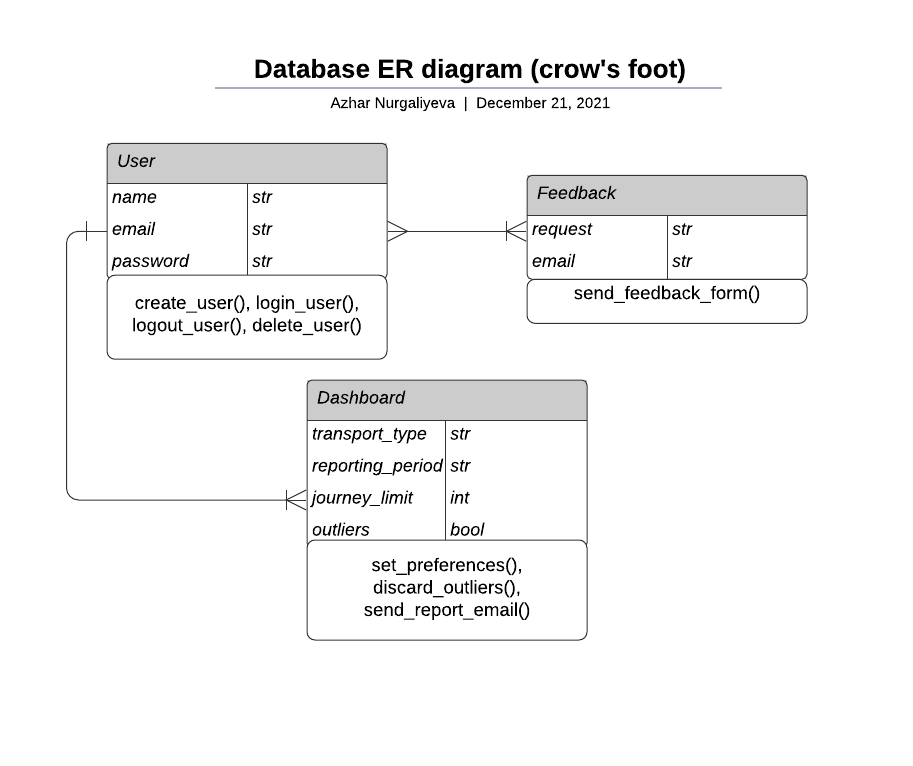
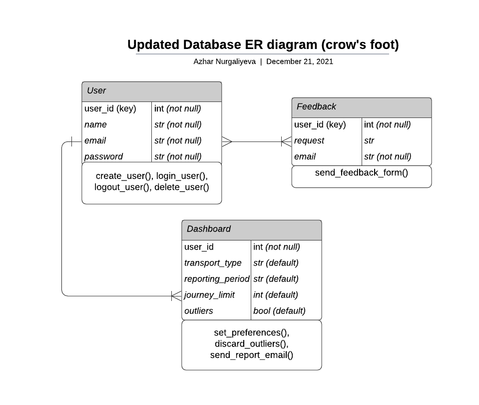

# Coursework 2

Candidate number: QNGH7

Student number: 19066600

Most students will use the same repository for coursework 2. You may use this file to present the results of that
coursework if you wish. Alternatively you can use video or audio to provide the explanations instead of writing them.

# Requirements definition and analysis

Defining requirements is essential for any software engineering project because they help us to achieve project's
objectives and meet stakeholders' needs.

**Requirements** define what the system or an app should do as well as any limitations regarding its proper operation
process.

There are 2 types of requirements:

- *Functional requirements* - description of what the system should do through explanation of functions or feature.
- *Non-functional requirements* - description of how the system should operate. They are mostly concerned with quality
  characteristics.

## Requirements identification methods

There are many ways to elicit the requirements for the project. Most commonly used techniques are:

1. Interview - asking users from target audience prepared questions about potential features.
2. Workshop - interactive session with a group of users on particular topics, which are prepared in advance.
3. Survey/ Questionnaire - collection of information through the prepared questions. To get the best answers it usually
   requires a lot of thinking process behind quantity and quality of questions.
4. Interface analysis - analysing interfaces to make sure that each component operates well with another one.
5. Focus group - interactive session with a particular group of users, which belong to the target audience. Similar to
   interviews, but usually involves a group of people.
6. Observation or ethnography - method of identifying requirements by observing how people behave in their actions and
   work.
7. Brainstorming - method of generating ideas by quickly thinking about them and writing them down.
8. Prototyping - experimental method which involves implementing ideas to a more tangible solution through design
   process.
9. Analysing documentation - allows eliciting requirements by analysing the documentation of the tools and design used.

For the purpose of this project, I decided to use ***brainstorming***, ***interface analysis*** and ***prototyping***
techniques.

Brainstorming helps to generate new ideas and encourages open collaboration. Interface analysis is essential as it helps
to improve the quality of interaction between the user and the app. Prototyping is important in order to get the most
user-friendly and appealing design.

All the other methods are not sensible for this project as they require finding an audience (interview, focus group,
workshop, survey/questionnaire, observation/ethnography) to collect information. This information cannot be used in the
scope of this project due to the ethics guidance and approval.

## Requirement specification method

User stories are the general descriptions of a function or certain feature that a potential user from target audience
might want. Some user stories might also cover desirable functionality, but not necessarily required. Methodology used
is agile, which is why ***user stories*** should be used to identify requirements as it is more useful. Moreover, user
stories make it easier to work across the team by giving a clear picture of what should be done.

Advantages of user stories:

- Easy to implement.
- User stories are helpful in understanding what potential users of the app might want to see in it.
- It provides a better insight into how the users would be interacting with the features of the app.
- They enable efficient and creative collaboration as it is easier for developers to understand the end result.

Disadvantages of user stories:

- Some requirements might not be caught clearly.
- It is difficult to implement for big and complex projects.
- Most users focus mostly on functional requirements rather than non-functional. Therefore, some essential
  non-functional requirements might be missed.

Considering the methodology used is agile and the scope of the project, user stories will be used to document
requirements. In order to minimise the impact of potential disadvantages, all requirements will be written using same
template (structure): "As a *role*, I want *goal* in order to *benefit*". In this particular case, role - "app user",
whereas goal and benefit would help to elicit the requirements.

Use cases have also been considered as a potential technique. Use cases involve description of a step-by-step process
that the user goes through to complete a certain goal. Compared to user stories, use cases have an advantage in how
detailed they are. A lot of essential points are intentionally left out of user stories. By asking questions during
scrum sessions, user stories are supposed to generate conversations and follow-up discussions. Rather than having a more
precise up-front demand formulation as in use cases, small pieces of feedback and results of discussions are used to
improve the output more regularly. Therefore, since the methodology used is agile, it means it is better to stick with
user stories as we do not need requirements with so much detail that there is no room for potential future
improvements.[1]

## Prioritisation method

***MoSCoW technique*** is one of the most popular techniques for prioritising requirements. [2]

As part of this technique all requirements are distributed into the following categories:

- **Must have**: essential requirements to meet the objectives of the project.
- **Should have**: the level of importance is similar to "Must have", but not time-sensitive.
- **Could have**: non-essential requirements that would be nice to have.
- **Won't have for now**: no significant value, which is why they could be considered later.

MoSCoW method has the following advantages:

1. It distinguishes all the requirements into 4 distinctive categories, which makes it easier to prioritise.
2. Development teams can use this tool to prioritise requirements based on budget, needs and skills.
3. It sets the expectations/objectives of the project from the very beginning.

However, there are some disadvantages of the MoSCoW technique:

1. There is no clear scoring process, which is why some requirements might be mislabeled and get placed in the wrong
   category.
2. There might be certain bias when labelling as there is no clear boundaries.
3. Some requirements depend on the stakeholders who are not the developers or users.

In this project, MoSCoW technique has been chosen for prioritisation of requirements because for initial stages certain
biases should not create a significant impact on the final outcome. Moreover, mislabelling can be avoided by following
standard guidelines.

## Documented and prioritised requirements

[Target audience (defined in README.md)](README.md): analysts who work in TfL.

Below are the user stories:

User story| Conditions of satisfaction |
--- | --- |
As an app user, I want an app to be not problematic/annoying so that I can login without too much trouble. | 1. Make the registration/login page easy to navigate.   2. Make the registration/login process fast (without too many additional information).|
As an app user, I want data presented in an engaging way so that I can change my preferences and focus on the key graphs. | 1. Create the "edit preferences" feature.   2. Make sure that only relevant data is shown.|
As an app user, I want an app to show the key trends on the main page so that I can use that statistics for my analysis. | 1. Show main trends in the data on the dashboard after logging in.   2. Make sure that the graphs are appropriate size and visible. |
As an app user, I want an app to be as responsive and fast as possible so that I don't have to wait for a long time. | 1. Make sure that the system responds within 1-2 seconds to any user input.   2. Make sure that there is not a strong dependency on the internet connection. |
As an app user, I want to receive an email with a report of the key analysis so that I can review it later without logging into the app again. | 1. Make sure that user's email is connected to user's account.   2. Create a separate feature for sending a report to user's email. |
As an app user, I want an app to be compatible with the latest OS versions so that I can use the app without any problems. | 1. Make sure that the system is responsive and compatible with the latest OS versions.   2. Create a "Feedback" feature to report potential bugs/errors.|

From user stories, we can deduce requirements for the app by analysing the conditions of satisfaction.

Requirement| Functional/non-functional | Prioritisation |
--- | --- | --- |
Accessible registration of a new user account | Functional | Must have |
Easy to navigate login page | Functional | Must have |
Straightforward navigation to logout button| Functional | Must have |
User should see the main data analytics on the dashboard | Functional | Must have |
The application should work with recent OS versions| Non-functional | Must have |
Give user a chance to change the parameters for shown data | Functional | Should have |
User should be able to leave feedback in case of any bugs/errors or to contact us for any suggestions | Functional | Should have |
System should respond to any change in parameters within 1-2 seconds| Non-functional | Should have |
System should be able to send an email to the user's email account with the analysis | Functional | Could have |

"Must have" requirements are the ones that are required for the initial version as they entail the main idea of this
project. "Should have" requirements are the ones that are also required, however, they can be added in later versions as
they are less time-sensitive. "Could have" requirements are the ones that could make the user experience better, but
they have less significant value.

All requirements have been validated by checking:

- ***validity*** - they should reflect the actual needs of the users.
- ***consistency*** - they should not contradict to other requirements and should not be repeated.
- ***completeness*** - they should include all the relevant information.
- ***realism*** - requirements should be realistic with respect to time, budget and resources.
- ***verifiability*** - the requirements can be tested.

# Design

In order to design the application server, it is important to work on application's routes, controllers, views and
models.

Each of these elements will be presented in the following way:

- views (wireframes that represent the structure of each page)
- routes and controllers (a list of the URLs and their associated controller functions)
- models (class + attributes + methods)

## Structure and flow of the interface

The target audience (TfL analysts) will most likely use the app the desktop rather than from the phone.

**Wireframes** are useful tools in interface design as they help to build the skeleton of the app or website. It helps
to organise the elements of the page and provide understanding for the basic architecture and design. [3]

Advantages of wireframing:

- Represent the needs and requirements of the users visually.
- Easy to implement for early stages of the project.
- Give a good outlook of the early visual design for initial feedback.
- Easier to amend the changes compared to concept designs.

Disadvantages of wireframing:

- Client might be confused by the idea of wireframes as they are quite basic compared to concept design.
- Efficient communication is required to make sure that concept design has all the functionality shown in wireframes.

Considering our methodology before, this project relies on improvement through feedback during scrum team sessions.
Despite certain disadvantages, wireframes still lower the risk of failure as they allow growth-driven future
development.

Therefore, the following structure and flow of the interface is suggested through wireframes:

Figure 1 - the home page of the website for the desktop use. In this wireframe, there is a home page, where new user can
register or existing user can find a button for login.

Figure 2 - the dashboards page for the desktop use with all the data dashboards. In this wireframe, the user can observe
main dashboards with analysis of data. The user can press on the specific graph he/she needs. The user can also request
a summary report to the email, which is connected to their email account.

Figure 3 - the preferences page for the desktop use in order to get a more personalised analysis of data. In this
wireframe, the user can edit the preferences so that only filtered data is displayed. Current filters are provisional
only and can be subject to change.

Figure 4 - the feedback page, where users can leave their feedback or requests, for the desktop use. In this wireframe,
the user can fill our a feedback form, which he/she can use to contact us regarding any questions, request or
bugs/errors.

## Application structure

To identify classes data driven design (DDD) approach is used. It heavily relies on the available information about
users and their behaviour. It helps to define classes without considering their responsibilities. Alternative approach
is responsibility driven design, where each class and its objects handle certain responsibility pieces. [4]

In order to define classes, requirements are used in the following way: nouns/noun phrases = classes, adjectives =
attributes, verbs/verb phrases = methods.

Class | Attributes (data type in brackets)| Methods |
--- | --- | --- |
1. Class name: user | name (str), email (str), password (str)| create_user(), login_user(), logout_user(), delete_user() |
2. Class name: dashboard | transport_type, reporting_period, journey_limit, outliers | set_preferences(), discard_outliers(), send_report_email() |
3. Class name: feedback | request (str), email (str) | send_feedback_form() |

We also need to define routes, which will be the URLs of our application. The best way to handle this is to have routes
corresponding to the wireframes made earlier. Apart from that, controller functions should be defined. They are needed
because they identify what will be happening when URLs are accessed by users.

Route | View (wireframe) | Controller function |
--- | --- | --- |
'/' | Index/Home page <1> | index() Sends the user to the home page. |
'/login' | Home page/Register or Login <1> | login() Takes the information entered by the user, checks against the details in the database, returns error if details incorrect otherwise redirects to user's account page. |
'/dashboard' | Dashboard <2> | get_dashboards() Calls the Dash dashboard app. |
'/preferences' | Change the preferences <3> | edit_preferences() Changes and filters out the data included on the graph. |
'/feedback' | Feedback <4> | leave_feedback() Sends the form with user's request or feedback. |

## Relational database design

Relational database design involves several things:

- Conceptual design
- Logical design
- Physical design

Conceptual design involves identifying entities and attributes. It should include any entities that are useful for the
application. The main idea of this stage is to capture the relationships between different entities using appropriate
notation.

The following ERD has been designed (LucidChart has been used):

When it comes to logical design stage, it is important to check the tables for normalisation first. In SQL, there is 3
possible modification anomalies. This is why there is first, second and third normalisation forms which prevent these
modification anomalies. The most common way is to normalise the design to third form, which involves:
- Only one entry at each row and column
- There is a primary key in every table (primary key is a unique ID)
- Related tables are linked with primary key relationships
- Robust to the deletion of certain records

Updated ERD:

# Testing

## Choice of unit testing library

## Tests

The tests should be in a separate and appropriately named file/directory.

## Test results

Provide evidence that the tests have been run and the results of the tests (e.g. screenshot).

## Continuous integration (optional)

Consider using GitHub Actions (or other) to establish a continuous integration pipeline. If you do so then please
provide a link to the .yml and a screenshot of the results of a workflow run.

# Weekly progress reports

### Report 1

What I did in the last week:

- Started putting up the requirements by using user stories.
- Went through the material for requirements and application design.

What I plan to do in the next week:

- Finalise the table for requirements.
- Work on application and interface design.

Issues blocking my progress (state ‘None’ if there are no issues):

- No issues, but I am not sure whether everything should be written text or we should add some diagrams too?

### Report 2

What I did in the last week:

- Learnt how to use wireframes for use cases.
- Started writing down use cases and thinking of how to represent wireframes.

What I plan to do in the next week:

- Finish diagrams with wireframes.
- Work on the design of the database.
- Work on the code quality.

Issues blocking my progress (state ‘None’ if there are no issues):

- I am not sure how to represent wireframes for certain use cases in the best ways.
- Should we make diagrams using certain software? Or can we like draw them in Paint or something?

### Report 3

What I did in the last week:

- Completed the user stories and requirements section.
- Made some diagrams (wireframes) for the design part.
- Started thinking about the design of the database.

What I plan to do in the next week:

- Continue on the design of the database.
- Start working on the testing part.

Issues blocking my progress (state ‘None’ if there are no issues):

- None right now.

### Report 4

What I did in the last week:

- Finished working with wireframes (decided to do desktop design, want to ask for feedback).
- Finished up with requirements (but probably will need to add more later on).
- Started working on the relational database design.
- Started thinking about potential tests.

What I plan to do in the next week:

- Finish design part.
- Complete all the tests and make sure they are valid.
- Try to do the optional task.

Issues blocking my progress (state ‘None’ if there are no issues):

- No issues.

# References

[1] “User Story vs Use Case for Agile Software Development,” Visual-paradigm.com, 2019.
https://www.visual-paradigm.com/guide/agile-software-development/user-story-vs-use-case/.

[2] Product plan, “What is MoSCoW Prioritization? | Overview of the MoSCoW Method,” Productplan.com, 2018.
https://www.productplan.com/glossary/moscow-prioritization/.

[3] M. Fisher, “What is wireframing?,” Experience UX, 2015. https://www.experienceux.co.uk/faqs/what-is-wireframing/.

[4] “Responsibility-driven design,” Wikipedia, May 22, 2021.
https://en.wikipedia.org/wiki/Responsibility-driven_design (accessed Dec. 21, 2021).