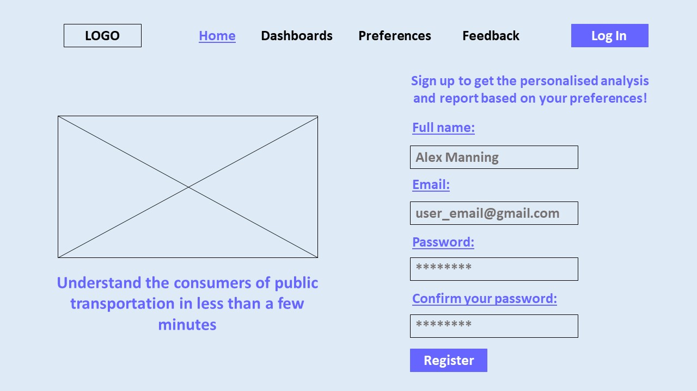
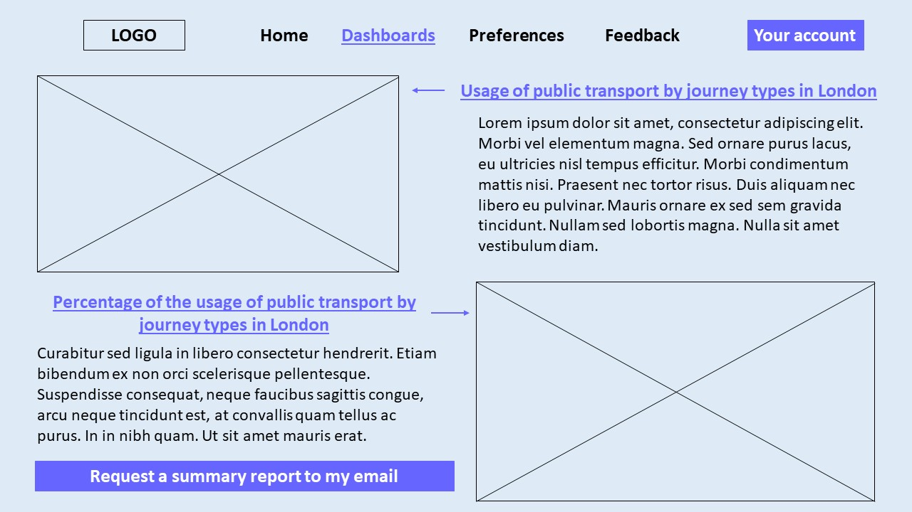
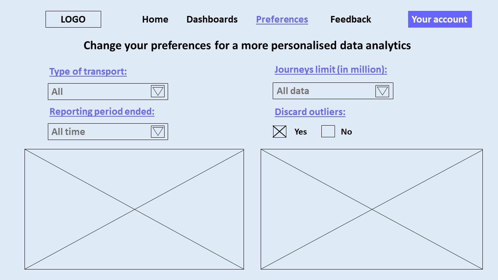
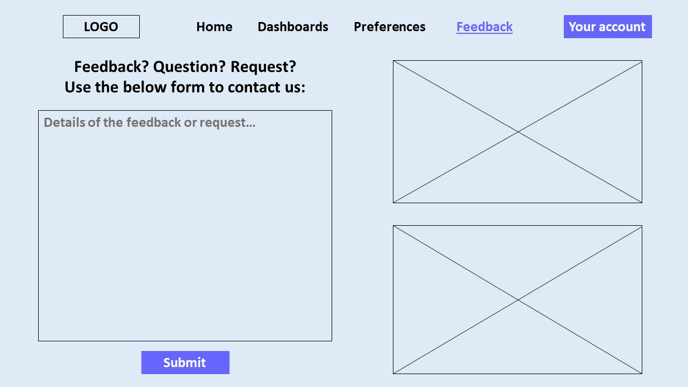

# Coursework 2

Most students will use the same repository for coursework 2. You may use this file to present the results of that
coursework if you wish. Alternatively you can use video or audio to provide the explanations instead of writing them.

# Requirements definition and analysis

Requirements help us to achieve project's objectives and meet stakeholders' needs.

**Requirements** define what the system or an app should do as well as any limitations regarding its proper operation
process.

There are 2 types of requirements:

- *Functional requirements* (description of what the system should do through explanation of functions, feature or
  behaviour)
- *Non-functional requirements* (description of how the system should operate)

## Requirements identification methods

There are many ways to elicit the requirements for the project:

1. Interview
2. Workshop
3. Survey/ Questionnaire
4. Interface analysis
5. Focus group
6. Observation or ethnography
7. Brainstorming
8. Prototyping
9. Analysing documentation

For the purpose of this project, I decided to use ***brainstorming***, ***interface analysis*** and ***prototyping***
techniques.

Brainstorming helps to generate new ideas and encourages open collaboration. Interface analysis is essential as it helps
to improve the interaction between the user and the app. Prototyping is important in order to get the most user-friendly
and appealing design.

## Requirement specification method

Methodology used is agile, which is why ***user stories*** should be used to identify requirements as it is more useful.

Advantages of user stories:

- Easy to implement.
- User stories are helpful in understanding what potential users of the app might want to see in it.
- It provides a better insight into how the users would be interacting with the features of the app.
- They enable efficient and creative collaboration as it is easier for developers to understand the end result.

Disadvantages of user stories:

- Some requirements might not be caught clearly.
- It is difficult to implement for big and complex projects.
- Most users focus mostly on functional requirements rather than non-functional. Therefore, some essential
  non-functional requirements might be missed.

## Prioritisation method

***MoSCoW technique*** has been chosen for prioritisation of requirements

As part of this technique all requirements are distributed into the following categories:

- **Must have**: essential requirements to meet the objectives of the project.
- **Should have**: the level of importance is similar to "Must have", but not time-sensitive.
- **Could have**: non-essential requirements that would be nice to have.
- **Won't have for now**: no significant value, which is why they could be considered later.

MoSCoW method has the following advantages:

1. It distinguishes all the requirements into 4 distinctive categories, which makes it easier to prioritise.
2. Development teams can use this tool to prioritise requirements based on budget, needs and skills.
3. It sets the expectations/objectives of the project from the very beginning.

However, there are some disadvantages of the MoSCoW technique:

1. There is no clear scoring process, which is why some requirements might be mislabeled and get placed in the wrong
   category.
2. There might be certain bias when labelling as there is no clear boundaries.
3. Some requirements depend on the stakeholders who are not the developers or users.

## Documented and prioritised requirements

[Target audience (defined in README.md)](README.md): analysts who work in TfL.

Below are the user stories:

User story| Conditions of satisfaction |
--- | --- |
As an app user, I want an app to be not problematic/annoying so that I can login without too much trouble. | 1. Make the registration/login page easy to navigate.   2. Make the registration/login process fast (without too many additional information).|
As an app user, I want data presented in an engaging way so that I can change my preferences and focus on the key graphs. | 1. Create the "edit preferences" feature.   2. Make sure that only relevant data is shown.|
As an app user, I want an app to show the key trends on the main page so that I can use that statistics for my analysis. | 1. Show main trends in the data on the dashboard after logging in.   2. Make sure that the graphs are appropriate size and visible. |
As an app user, I want an app to be as responsive and fast as possible so that I don't have to wait for a long time. | 1. Make sure that the system responds within 1-2 seconds to any user input.   2. Make sure that there is not a strong dependency on the internet connection. |
As an app user, I want to receive an email with a report of the key analysis so that I can review it later without logging into the app again. | 1. Make sure that user's email is connected to user's account.   2. Create a separate feature for sending a report to user's email. |
As an app user, I want an app to be compatible with the latest OS versions so that I can use the app without any problems. | 1. |

From user stories, we can deduce requirements for the app by analysing the conditions of satisfaction.

Requirement| Functional/non-functional | Prioritisation |
--- | --- | --- |
Create a new user account | Functional | Must have |
Login page | Functional | Must have |
Logout button | Functional | Must have |
Show main data analytics on the dashboard | Non-functional | Must have |
Give user a chance to change the parameters for shown data | Functional | Should have |
The application should work with recent OS versions| Non-functional | Must have |
System should respond to any change in parameters within 1-2 seconds| Non-functional | Should have |
System should be able to send an email to the user's email account with the analysis | Functional | Could have |

All requirements have been validated by checking:

- ***validity*** (do they reflect the actual needs of the user?)
- ***consistency*** (they should not contradict to other requirements and should not be repeated)
- ***completeness*** (do they include all the relevant information?)
- ***realism*** (is it realistic to complete these requirements with our budget, time constraint and technology used?)
- ***verifiability*** (is it possible to test these requirements?)

# Design

In order to design the application server, it is important to work on application's routes, controllers, views and
models.

Each of these elements will be presented in the following way:

- routes and controllers (a list of the URLs and their associated controller functions)
- models (class + attributes + methods)
- views (wireframes that represent the structure of each page)

## Structure and flow of the interface

The target audience (TfL analysts) will most likely use the app the desktop rather than from the phone.

Therefore, the following structure and flow of the interface is suggested:

Figure 1 - the home page of the website for the desktop use.

Figure 2 - the dashboards page for the desktop use with all the data dashboards.

Figure 3 - the preferences page for the desktop use in order to get a more personalised analysis of data.

Figure 4 - the feedback page, where users can leave their feedback or requests, for the desktop use.

## Application structure

1. Class name: ... ; Attributes: ... ; Methods: make_sound(), move()

2. Class name: ... ; Attributes: ... ; Methods: ...

Route | View (wireframe) | Controller function |
--- | --- | --- |
'/' | <id_number> | index() Sends the user to the home page. |
'/login' | <1> | login() Takes the information entered by the user, checks against the details in the database, returns error if details incorrect otherwise redirects to user's account page. |
'/home' | <1> | ... |
'/dashboards' | <2> | ... |
'/preferences' | <3> | ... |
'/feedback' | <4> | ... |
'/logout' | <id_number> | logout() Logs out the user from the account, returns user to login page, returns error if there is a problem with internet connection. |

## Relational database design

Tables, attributes and relationships between the tables

# Testing

## Choice of unit testing library

## Tests

The tests should be in a separate and appropriately named file/directory.

## Test results

Provide evidence that the tests have been run and the results of the tests (e.g. screenshot).

## Continuous integration (optional)

Consider using GitHub Actions (or other) to establish a continuous integration pipeline. If you do so then please
provide a link to the .yml and a screenshot of the results of a workflow run.

# Weekly progress reports

### Report 1

What I did in the last week:

- Started putting up the requirements by using user stories.
- Went through the material for requirements and application design.

What I plan to do in the next week:

- Finalise the table for requirements.
- Work on application and interface design.

Issues blocking my progress (state ‘None’ if there are no issues):

- No issues, but I am not sure whether everything should be written text or we should add some diagrams too?

### Report 2

What I did in the last week:

- Learnt how to use wireframes for use cases.
- Started writing down use cases and thinking of how to represent wireframes.

What I plan to do in the next week:

- Finish diagrams with wireframes.
- Work on the design of the database.
- Work on the code quality.

Issues blocking my progress (state ‘None’ if there are no issues):

- I am not sure how to represent wireframes for certain use cases in the best ways.
- Should we make diagrams using certain software? Or can we like draw them in Paint or something?

### Report 3

What I did in the last week:

- Completed the user stories and requirements section.
- Made some diagrams (wireframes) for the design part.
- Started thinking about the design of the database.

What I plan to do in the next week:

- Continue on the design of the database.
- Start working on the testing part.

Issues blocking my progress (state ‘None’ if there are no issues):

- None right now.

### Report 4

What I did in the last week:

- item
- item

What I plan to do in the next week:

- item
- item

Issues blocking my progress (state ‘None’ if there are no issues):

- item
- item

# References

Delete this instruction text before submitting:

- Include references to any templates you have used.
- If you justify any of your choices with references then remember to also include these.
- Use any [referencing style](https://library-guides.ucl.ac.uk/referencing-plagiarism/referencing-styles) that you are
  used to using in your course.
